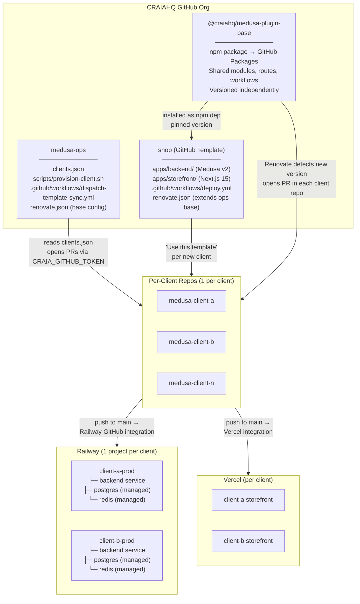
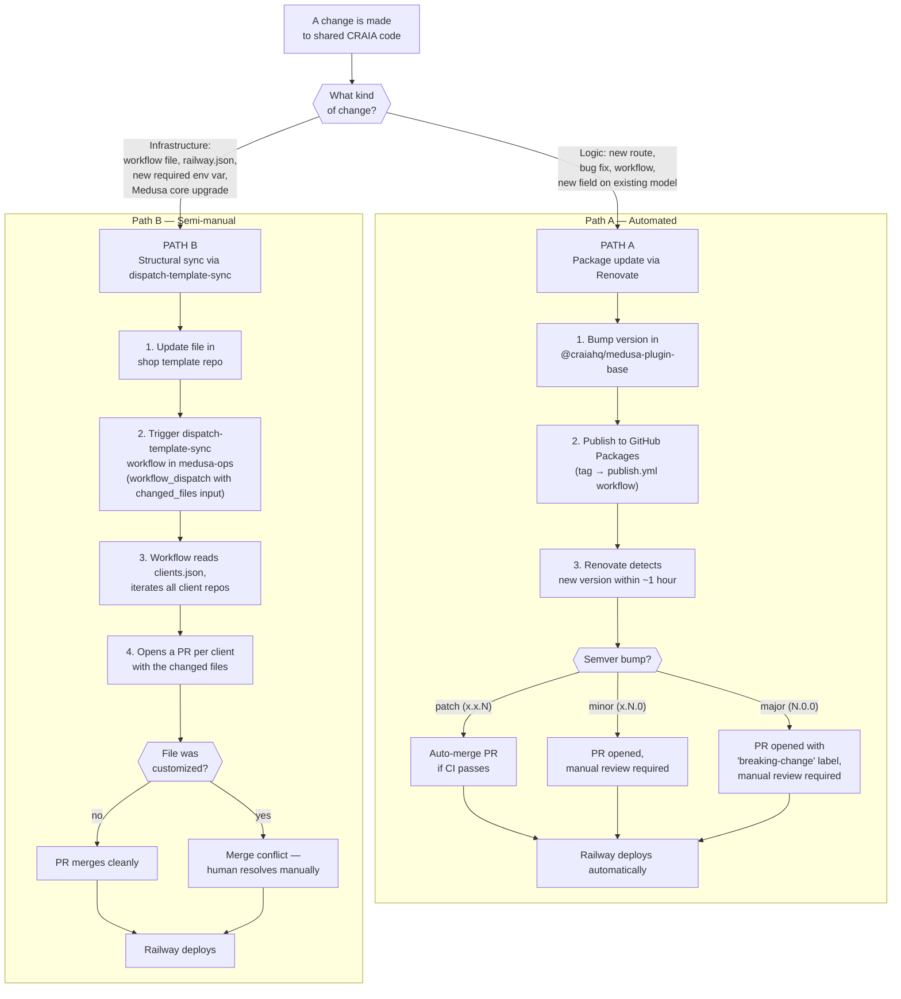
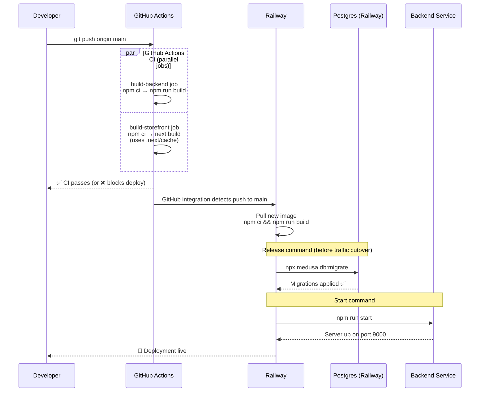
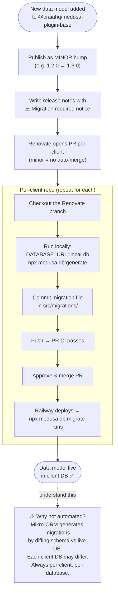
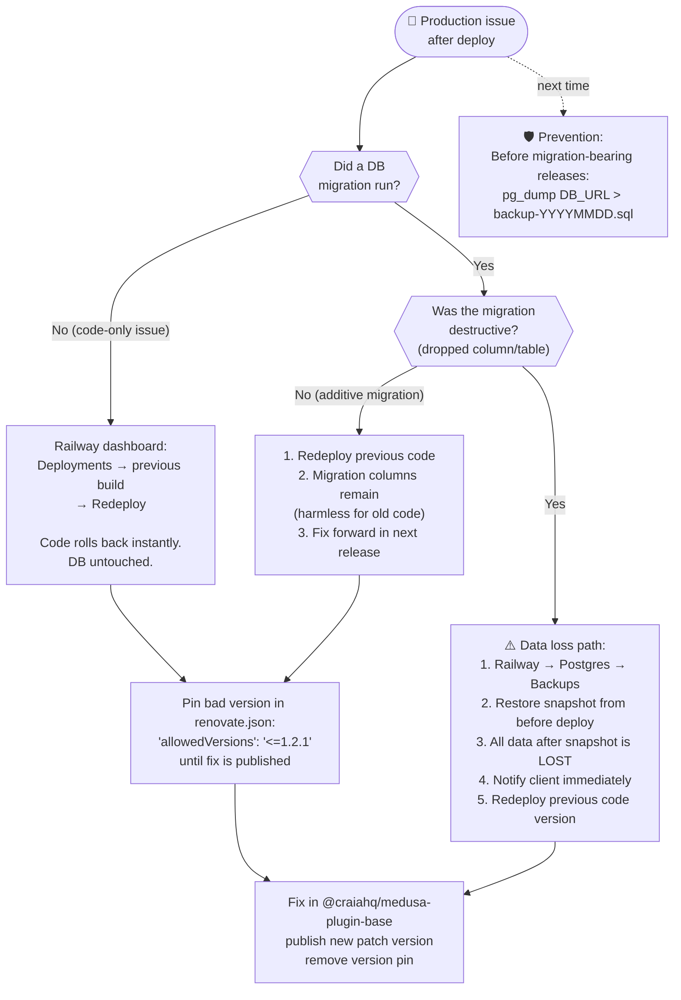
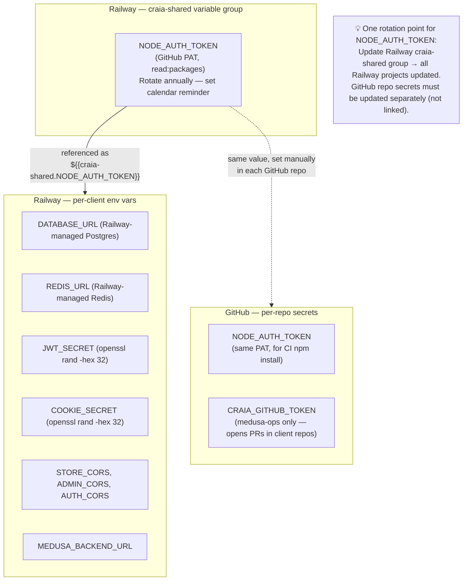

# CRAIA Platform — Architecture Diagrams

---

## 1. Overall System Architecture

---

## 2. Update Propagation — Path A vs Path B

---

## 3. Deploy Flow (per client push to main)

---

## 4. New Client Onboarding

```mermaid
flowchart LR
    START(["New client\nagreed ✅"])

    START --> S1["1️⃣ Create repo from template\ngh repo create CRAIAHQ/medusa-client\n--template CRAIAHQ/medusa-template --private"]
    S1 --> S2["2️⃣ Add NODE_AUTH_TOKEN\nsecret to new repo\n(from Railway craia-shared group)"]
    S2 --> S3["3️⃣ Run provisioning script\nfrom medusa-ops:\n./scripts/provision-client.sh client-slug"]

    S3 --> S3A["Railway creates:\n• Project: client-prod\n• Postgres service\n• Redis service"]

    S3A --> S4["4️⃣ Set env vars in Railway\nJWT_SECRET, COOKIE_SECRET,\nSTORE_CORS, ADMIN_CORS,\nMEDUSA_BACKEND_URL, ..."]
    S4 --> S5["5️⃣ Link GitHub repo to\nRailway backend service"]
    S5 --> S6["6️⃣ Set Railway release command:\nnpx medusa db:migrate"]

    S6 --> S7["7️⃣ Trigger first deploy\n(push any commit to main)"]
    S7 --> S8["8️⃣ Run seed script\nrailway run npx medusa exec\nsrc/scripts/seed.ts"]
    S8 --> S9["9️⃣ Create admin user\nnpx medusa user\n-e admin@craia.net -p password"]
    S9 --> S10["🔟 Add client to\nmedusa-ops/clients.json"]
    S10 --> S11["1️⃣1️⃣ Deploy storefront\nto Vercel"]

    S11 --> DONE(["Client live 🎉\n~5 min automated\n+ ~30 min manual setup"])
```

---

## 5. Migration-Bearing Plugin Update (special case)

---

## 6. Emergency Rollback Decision Tree

---

## 7. Secrets Architecture

